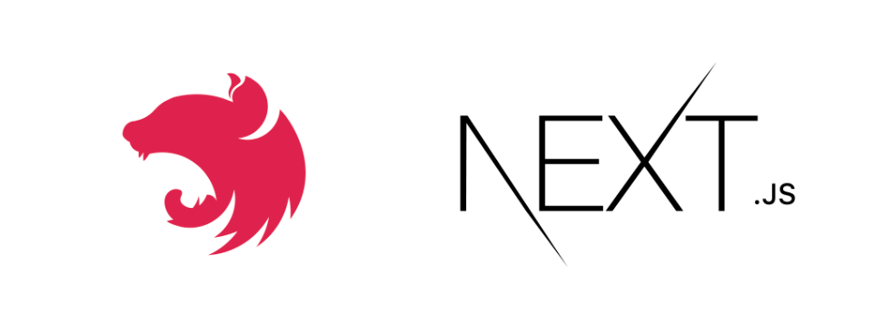

# Mono Next Nest Template

[![MIT License][license-shield]][license-url]
[![LinkedIn][linkedin-shield]][linkedin-url]

<div align="center">
  <a href="https://gitlab.com/tetris973/mono-next-nest-template">
    
  </a>

<h3 align="center">Mono Next Nest Template</h3>

  <p align="center">
    A monorepo with NestJS backend and Next.js frontend deployed with Docker.
    <br />
    <a href="https://gitlab.com/tetris973/mono-next-nest-template"><strong>Explore the docs »</strong></a>
    <br />
    <br />
    <!-- <a href="https://gitlab.com/tetris973/mono-next-nest-template">View Demo</a> -->
    ·
    <a href="https://gitlab.com/tetris973/mono-next-nest-template/-/issues/new">Report Bug</a>
    ·
    <a href="https://gitlab.com/tetris973/mono-next-nest-template/-/issues/new">Request Feature</a>
  </p>
</div>

## Table of Contents
- [About The Project](#about-the-project)
- [Built With](#built-with)
- [Getting Started](#getting-started)
  - [Prerequisites](#prerequisites)
  - [Installation](#installation)
- [Development Setup](#development-setup)
  - [Backend Setup](#backend-setup)
  - [Frontend Setup](#frontend-setup)
  - [Docker Compose Development](#docker-compose-development)
  - [Accessing the Application](#accessing-the-application)
- [Testing](#testing)
  - [Quick Start](#quick-start)
  - [Continuous Integration](#continuous-integration)
- [Production Setup](#production-setup)
  - [Quick Start](#quick-start-1)
- [Deployment](#deployment)
- [Usage](#usage)
- [Roadmap](#roadmap)
- [Contributing](#contributing)
- [License](#license)
- [Contact](#contact)
- [Acknowledgments](#acknowledgments)

## About The Project

This is a monorepo template with a NestJS backend (using Prisma) and a Next.js frontend, configured for Docker deployment. It includes:

- Unit and E2E testing
- Continuous Integration (CI)
- Logging
- Authentication
- React component library
- And more

The goal is to provide a working example of how various tools and concepts can be integrated into a full-stack project. This setup aims to be correct and functional, but it's not claiming to be the best or only way to do things. Your specific needs may require different approaches.

This project is regularly updated. Your feedback and contributions are valuable for its improvement.

## Built With

* [![Next][Next.js]][Next-url]
* [![React][React.js]][React-url]
* [![NestJS][NestJS]][NestJS-url]
* [![TypeScript][TypeScript]][TypeScript-url]
* [![Prisma][Prisma]][Prisma-url]
* [![Docker][Docker]][Docker-url]
* [![pnpm][pnpm]][pnpm-url]
* [![Vitest][Vitest]][Vitest-url]
* [![Playwright][Playwright]][Playwright-url]
* [![Chakra UI][Chakra-UI]][Chakra-UI-url]

## Getting Started

To get a local copy up and running, follow these steps.

### Prerequisites

Before you begin, ensure you have the following tools and software installed on your system:

- **Git**: Version control system
- **Node.js**: JavaScript runtime (version 20.x recommended)
- **pnpm**: Package manager
- **Docker**: Containerization platform
- **Visual Studio Code** (recommended): IDE

For detailed installation instructions and recommended configurations, please refer to our [Detailed Setup Guide](docs/SETUP.md).

### Installation

1. Clone the repository
   ```sh
   git clone https://gitlab.com/tetris973/mono-next-nest-template.git
   ```
2. Navigate to the project directory
   ```sh
   cd mono-next-nest-template
   ```
3. Install dependencies
   ```sh
   pnpm install
   ```

## Development Setup

This section guides you through setting up the development environment for both the backend and frontend of the project.

### Backend Setup

1. Navigate to the server directory:
   ```sh
   cd apps/server
   ```

2. Set up environment variables:
   - Copy the example environment file:
     ```sh
     cp .env.example .env.development.local
     ```
   - Open `.env.development.local` and adjust the values as needed for your local development environment.

3. Install dependencies:
   ```sh
   pnpm install
   ```

4. Set up the database:
   - Ensure your database server is running. See the [Docker Compose Development](#docker-compose-development) section for details on setting up the database using Docker.
   - Run migrations to generate Prisma types and apply the schema to the database:
     ```sh
     pnpm db-migrate
     ```
   - Seed the dev database:
     ```sh
     pnpm db-seed
     ```

   You can check the seeded data using Prisma Studio:
   ```sh
   pnpm db-studio
   ```

5. Start the development server:
   ```sh
   pnpm run dev
   ```

6. The backend server should now be running. You can access the API documentation at `http://localhost:4000/api` (adjust the port if you've changed it in your environment variables).

For instructions on how to test the server, login, and API using Swagger, please refer to our [API Testing Guide](docs/API_TESTING.md).

### Frontend Setup

1. Navigate to the web directory:
   ```sh
   cd apps/web
   ```

2. Set up environment variables:
   - Copy the example environment file:
     ```sh
     cp .env.example .env.development.local
     ```
   - Open `.env.development.local` and adjust the values as needed for your local development environment.

3. Install dependencies:
   ```sh
   pnpm install
   ```

4. Generate DTOs from the backend:
   ```sh
   cd ../server
   pnpm run build:dto
   ```
   Note: The `build:dto` command may display type errors from Prisma. This is normal as long as all the `.d.ts` type files are generated for each DTO of the backend in the `shared` folder.

5. Return to the web directory and start the development server:
   ```sh
   cd ../web
   pnpm run dev
   ```

6. The frontend development server should now be running. You can access it at `http://localhost:3000` (adjust the port if you've changed it in your environment variables).

### Docker Compose Development

To set up the development environment using Docker Compose:

1. From the root of the project directory, start the Docker Compose services:
   ```sh
   pnpm compose:dev
   ```

This command starts a PostgreSQL database and pgAdmin, a web-based database management tool.

For detailed instructions on using pgAdmin and other Docker-related configurations, please refer to our [Docker Development Guide](docs/DOCKER_DEV_GUIDE.md).

### Accessing the Application

- Frontend: `http://localhost:3000`
- Backend API: `http://localhost:4000`
- API Documentation (Swagger): `http://localhost:4000/api`

Remember to replace the ports if you've configured different ones in your environment variables.

## Testing

This project includes a variety of tests for both the backend and frontend to ensure everything works as expected.

For detailed instructions on setting up the testing environment, running tests, and understanding our approach to testing, check out our [Testing Guide](docs/TESTING.md).

### Quick Start

To run tests:

1. Backend Tests:
   ```sh
   cd apps/server
   pnpm run test        # Unit tests
   pnpm run test:e2e    # End-to-end tests
   ```

2. Frontend Tests:
   ```sh
   cd apps/web
   pnpm run test        # Unit tests
   pnpm run test:e2e    # End-to-end tests
   ```

Note: End-to-end tests require additional setup. See the [Testing Guide](docs/TESTING.md) for details.

### Continuous Integration

This project uses GitLab CI/CD for continuous integration. For detailed information about our CI pipeline, including stages, environment setup, and notes on Docker builds, please refer to our [CI documentation](./docs/CI.md).

## Production Setup

This section provides a quick overview of setting up the project for production.

### Quick Start

To prepare the project for production:

1. Backend Setup:
   ```sh
   cd apps/server
   cp .env.example .env.production.local   # Set up production environment variables
   pnpm run build                          # Build the backend
   pnpm run build:dto                      # Generate DTOs for the frontend
   pnpm run db-migrate:prod                # Apply production database migrations
   pnpm run db-seed:prod                   # Seed prod database
   pnpm run start:prod
   ```

2. Frontend Setup:
   ```sh
   cd apps/web
   cp .env.example .env.production.local   # Set up production environment variables
   pnpm run build                          # Build the frontend
   pnpm run start
   ```

Note: Ensure you edit the `.env.production.local` files in both `apps/server` and `apps/web` directories with the appropriate production values before building.

Note: `.env.production.local` is needed for building Next.js, as it runs some files that perform environment validation. If this file is not present, the build will fail.

## Deployment

For detailed deployment instructions, including local Docker deployment and server deployment guidelines, please refer to our [Deployment Guide](./docs/DEPLOYMENT.md).

## Usage

[This section needs to be completed with specific usage examples, screenshots, or demos of the project in action. Consider adding code snippets, API usage examples, or links to more comprehensive documentation.]

## Roadmap

- [ ] Feature 1
- [ ] Feature 2
- [ ] Feature 3
    - [ ] Nested Feature

See the [open issues](https://gitlab.com/tetris973/mono-next-nest-template/-/issues) for a full list of proposed features (and known issues).

## Contributing

[This section needs to be completed with guidelines for contributing to the project. Consider including information about the coding style, pull request process, and any other relevant details.]

## License

Distributed under the MIT License. See `LICENSE.txt` for more information.

## Contact

Project Link: [https://gitlab.com/tetris973/mono-next-nest-template/](https://gitlab.com/tetris973/mono-next-nest-template/)

## Acknowledgments

[This section needs to be completed with acknowledgments to resources, libraries, or individuals that have been helpful in the development of this project.]

<!-- MARKDOWN LINKS & IMAGES -->
[license-shield]: https://img.shields.io/gitlab/license/tetris973/mono-next-nest-template?style=for-the-badge
[license-url]: https://gitlab.com/tetris973/mono-next-nest-template/-/blob/main/LICENSE.txt
[linkedin-shield]: https://img.shields.io/badge/-LinkedIn-black.svg?style=for-the-badge&logo=linkedin&colorB=555
[linkedin-url]: https://www.linkedin.com/in/cedric-olender/
[Next.js]: https://img.shields.io/badge/next.js-000000?style=for-the-badge&logo=nextdotjs&logoColor=white
[Next-url]: https://nextjs.org/
[React.js]: https://img.shields.io/badge/React-20232A?style=for-the-badge&logo=react&logoColor=61DAFB
[React-url]: https://reactjs.org/
[NestJS]: https://img.shields.io/badge/nestjs-%23E0234E.svg?style=for-the-badge&logo=nestjs&logoColor=white
[NestJS-url]: https://nestjs.com/
[TypeScript]: https://img.shields.io/badge/typescript-%23007ACC.svg?style=for-the-badge&logo=typescript&logoColor=white
[TypeScript-url]: https://www.typescriptlang.org/
[Prisma]: https://img.shields.io/badge/Prisma-3982CE?style=for-the-badge&logo=Prisma&logoColor=white
[Prisma-url]: https://www.prisma.io/
[Docker]: https://img.shields.io/badge/docker-%230db7ed.svg?style=for-the-badge&logo=docker&logoColor=white
[Docker-url]: https://www.docker.com/
[pnpm]: https://img.shields.io/badge/pnpm-%234a4a4a.svg?style=for-the-badge&logo=pnpm&logoColor=f69220
[pnpm-url]: https://pnpm.io/
[Vitest]: https://img.shields.io/badge/vitest-%234a4a4a.svg?style=for-the-badge&logo=vitest&logoColor=white
[Vitest-url]: https://vitest.dev/
[Playwright]: https://img.shields.io/badge/playwright-%232EAD33.svg?style=for-the-badge&logo=playwright&logoColor=white
[Playwright-url]: https://playwright.dev/
[Chakra-UI]: https://img.shields.io/badge/chakra-%234ED1C5.svg?style=for-the-badge&logo=chakraui&logoColor=white
[Chakra-UI-url]: https://chakra-ui.com/