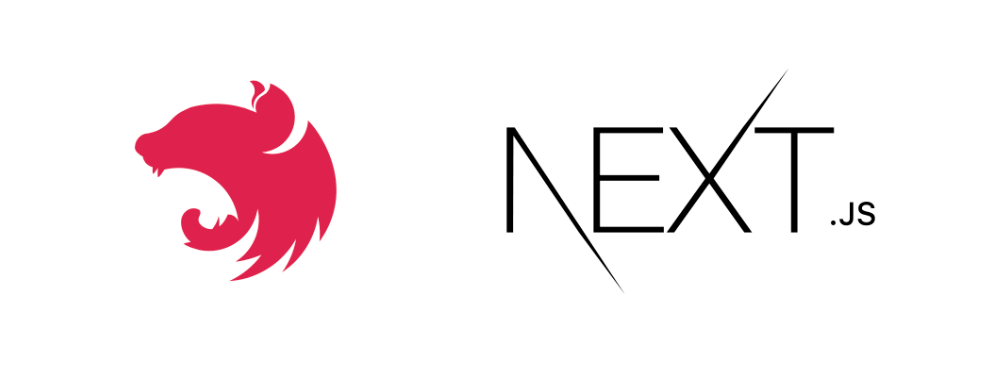

# Mono Next Nest Template

[![MIT License][license-shield]][license-url]
[![LinkedIn][linkedin-shield]][linkedin-url]

  

  <h3 align="center">Mono Next Nest Template</h3>

  

    A monorepo with NestJS backend and Next.js frontend deployed with Docker.
     
    <a href="https://tetris973.gitlab.io/mono-next-nest-template/docs"><strong>Explore the docs »</strong></a>
     
     
    <a href="https://tetris973.gitlab.io/mono-next-nest-template/docs">Getting Started</a>
    |
    <a href="https://gitlab.com/tetris973/mono-next-nest-template/-/issues/new">Report Bug</a>
    |
    <a href="https://gitlab.com/tetris973/mono-next-nest-template/-/issues/new">Request Feature</a>
  

# Features

## Global Features

- Monorepo structure for unified project management
- [Docker](https://www.docker.com/) support for local development and production deployment
- Continuous Integration with [GitLab CI/CD](https://docs.gitlab.com/ee/ci/)
- [TypeScript](https://www.typescriptlang.org/) for enhanced code quality and type safety
- [ESLint](https://eslint.org/) and [Prettier](https://prettier.io/) for code formatting and linting
- [Pino](https://getpino.io/) and [pino-http](https://github.com/pinojs/pino-http) for logging, including automatic HTTP request logging

## Backend Features ([NestJS](https://nestjs.com/))

- NestJS framework for opinionated server architecture
- Authentication system with local and JWT strategies using [Passport](http://www.passportjs.org/)
- Authorization with [CASL](https://casl.js.org/v6/en/) for Role-Based Access Control (RBAC) or Attribute-Based Access Control (ABAC)
- [Prisma](https://www.prisma.io/) ORM for database management and migrations
- [Postgres](https://www.postgresql.org/) database deployed as docker container for local and production environments
- [Kysely](https://kysely.dev/) extension for Prisma, providing type-safe query building
- [Swagger](https://swagger.io/) integration for API documentation and testing
- [Vitest](https://vitest.dev/) for unit testing and end-to-end (E2E) testing

## Frontend Features ([Next.js](https://nextjs.org/))

- Next.js 14+ with app directory for opinionated frontend app architecture
- [React 18](https://reactjs.org/) with server components and client components
- [Mantine](https://mantine.dev/) for component library and styling
- [Playwright](https://playwright.dev/) for end-to-end (E2E) testing
- [Vitest](https://vitest.dev/) for unit and component testing
- [Storybook](https://storybook.js.org/) for component development and visualization

## Development and Tooling

- [pnpm](https://pnpm.io/) for efficient package management
- [Husky](https://typicode.github.io/husky/) with [Lint-staged](https://github.com/okonet/lint-staged) for automatic linting
- Custom Docker images for development and CI environments
- Documentation as close as possible to the code using [Docusaurus](https://docusaurus.io/) and [JSDoc](https://jsdoc.app/)

## Usage

[This section needs to be completed with specific usage examples, screenshots, or demos of the project in action. Consider adding code snippets, API usage examples, or links to more comprehensive documentation.]

## Roadmap

- [ ] Feature 1
- [ ] Feature 2
- [ ] Feature 3
    - [ ] Nested Feature

See the [open issues](https://gitlab.com/tetris973/mono-next-nest-template/-/issues) for a full list of proposed features (and known issues).

## Contributing

[This section needs to be completed with guidelines for contributing to the project. Consider including information about the coding style, pull request process, and any other relevant details.]

## License

Mono Next Nest Template is [MIT licensed](LICENSE).

## Contact

Project Link: [https://gitlab.com/tetris973/mono-next-nest-template/](https://gitlab.com/tetris973/mono-next-nest-template/)

## Acknowledgments

[This section needs to be completed with acknowledgments to resources, libraries, or individuals that have been helpful in the development of this project.]

<!-- MARKDOWN LINKS & IMAGES -->
[license-shield]: https://img.shields.io/badge/license-MIT-green?style=for-the-badge
[license-url]: https://gitlab.com/tetris973/mono-next-nest-template/-/blob/main/LICENSE.txt
[linkedin-shield]: https://img.shields.io/badge/-LinkedIn-black.svg?style=for-the-badge&logo=linkedin&colorB=555
[linkedin-url]: https://www.linkedin.com/in/cedric-olender/